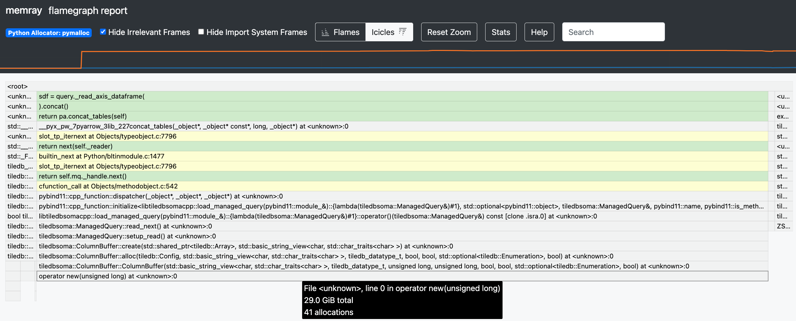
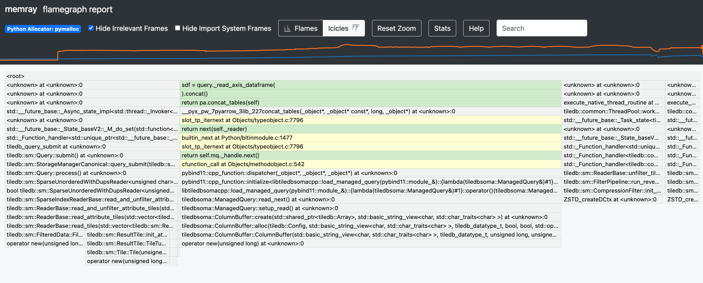

# DataFrame-fetch profiling

<!-- toc -->
- [`mem.py`: profile Census `obs` fetch](#mem.py)
- [Ureter (2,390 cells) → 30.5 GiB](#ureter)
    - [Interactive flamegraph](#ureter-flamegraph)
    - [Top allocations](#ureter-top-allocs)
- [Lung (3.68MM cells) → 31.2 GiB](#lung)
    - [Interactive flamegraph](#lung-flamegraph)
    - [Top allocations](#lung-top-allocs)
- [Lung (3.68MM cells), reduced `soma.init_buffer_bytes` → 4.9 GiB](#lung-100M)
    - [Interactive flamegraph](#lung-100M-flamegraph)
    - [Top allocations](#lung-100M-top-allocs)
<!-- /toc -->


## [`mem.py`]: profile Census `obs` fetch <a id="mem.py"></a>

[`mem.py`] is a simple CLI for performing a Census query, for cells with a given `tissue_general` value, and fetching `obs` as a Pandas DataFrame:

<!-- `bmdf -- mem.py` -->
```bash
mem.py
# Usage: mem.py [OPTIONS]
#
#   Output feather files containing the obs and var joinids responsive to a
#   CELLxGENE Census query.
#
# Options:
#   -b, --mem-total-budget TEXT    TileDB "sm.mem.total_budget" config value
#                                  (default: "10GiB")
#   -c, --columns TEXT             DataFrame columns to fetch
#   -C, --census-version TEXT      Default: 2024-07-01
#   -K, --no-keep-memray-bin       Rm memray profile before exiting
#   -o, --out-dir TEXT             Write Memray profile, stats, and flamegraph
#                                  to this directory
#   -p, --trace-python-allocators  Pass `trace_python_allocators=True` to Memray
#   -t, --tissue TEXT              Query Census cells with this `tissue_general`
#                                  value
#   -V, --fetch-vars               Profile fetching `vars` DataFrame (default:
#                                  `obs`)
#   --help                         Show this message and exit.
```

## Ureter (2,390 cells) → 30.5 GiB <a id="ureter"></a>

For some reason, [Memray] reports peak memory use of 30.5 GiB when fetching fewer than 3,000 ureter cells:
<!-- `bmdf -- time mem.py -t ureter -b 2G` -->
```bash
time -p mem.py -t ureter -b 2G
# mem.Tracker removing out/ureter/obs.memray
# memray logging to out/ureter/obs.memray
# open took 0.654s
# query took 2.34s
# obs took 10.5s
# obs-df took 0.0476s
# Running: memray stats --json -fo out/ureter/obs.stats.json out/ureter/obs.memray
# Running: memray flamegraph -fo out/ureter/obs.html out/ureter/obs.memray
# obs (2390, 28): soma_joinid,dataset_id,assay,assay_ontology_term_id,cell_type,cell_type_ontology_term_id,development_stage,development_stage_ontology_term_id,disease,disease_ontology_term_id,donor_id,is_primary_data,observation_joinid,self_reported_ethnicity,self_reported_ethnicity_ontology_term_id,sex,sex_ontology_term_id,suspension_type,tissue,tissue_ontology_term_id,tissue_type,tissue_general,tissue_general_ontology_term_id,raw_sum,nnz,raw_mean_nnz,raw_variance_nnz,n_measured_vars
# {
#   "peak_mem": 32770216844,
#   "top_allocs": [
#     {
#       "location": "__next__:/home/ubuntu/TileDB-SOMA/apis/python/src/tiledbsoma/_read_iters.py:599",
#       "size": 31141112262,
#       "iec": "29 GiB"
#     },
#     {
#       "location": "<stack trace unavailable>",
#       "size": 16525295308,
#       "iec": "15.4 GiB"
#     },
#     {
#       "location": "_read_axis_dataframe:/home/ubuntu/TileDB-SOMA/apis/python/src/tiledbsoma/_query.py:816",
#       "size": 67112324,
#       "iec": "64 MiB"
#     },
#     {
#       "location": "open:/home/ubuntu/TileDB-SOMA/apis/python/src/tiledbsoma/_tdb_handles.py:96",
#       "size": 25655197,
#       "iec": "24.5 MiB"
#     },
#     {
#       "location": "native_context:/home/ubuntu/TileDB-SOMA/apis/python/src/tiledbsoma/options/_soma_tiledb_context.py:213",
#       "size": 4338669,
#       "iec": "4.14 MiB"
#     }
#   ],
#   "tracked_allocs": 1276994,
#   "tracked_bytes": 47767911331,
#   "total_allocs": 2330275,
#   "total_frames": 1047
# }
# Peak memory use: 32770216844 (30.5 GiB)
# real 18.77
# user 28.01
# sys 347.34
```

([out/ureter/obs.stats.json](out/ureter/obs.stats.json))

However, according to `htop`, system-wide memory use increased by <1G during this run.

### Interactive flamegraph <a id="ureter-flamegraph"></a>

[][ureter html]

([rw-tdb-west2.s3.amazonaws.com/tdbs-mem/out/ureter/obs.html][ureter html])

### Top allocations <a id="ureter-top-allocs"></a>
Summarizing / Linking the top allocations reported above:

<!-- `top-allocs.py -mt rw/mem out/ureter/obs.stats.json` -->
<div>

- [tiledbsoma/\_read\_iters.py](http://github.com/single-cell-data/TileDB-SOMA/blob/rw/mem/apis/python/src/tiledbsoma/_read_iters.py#L599): 29 GiB
- `<stack trace unavailable>`: 15.4 GiB
- [tiledbsoma/\_query.py](http://github.com/single-cell-data/TileDB-SOMA/blob/rw/mem/apis/python/src/tiledbsoma/_query.py#L816): 64 MiB
- [tiledbsoma/\_tdb\_handles.py](http://github.com/single-cell-data/TileDB-SOMA/blob/rw/mem/apis/python/src/tiledbsoma/_tdb_handles.py#L96): 24.5 MiB
- [tiledbsoma/options/\_soma\_tiledb\_context.py](http://github.com/single-cell-data/TileDB-SOMA/blob/rw/mem/apis/python/src/tiledbsoma/options/_soma_tiledb_context.py#L213): 4.14 MiB
</div>

## Lung (3.68MM cells) → 31.2 GiB <a id="lung"></a>

When fetching 1,500x as many cells, [Memray] reports reports peak memory use of 31.2 GiB, (<1 GiB more than before):

<!-- `bmdf -- time mem.py -t lung -b 2G` -->
```bash
time -p mem.py -t lung -b 2G
# mem.Tracker removing out/lung/obs.memray
# memray logging to out/lung/obs.memray
# open took 0.72s
# query took 2.54s
# obs took 31.6s
# obs-df took 2.08s
# Running: memray stats --json -fo out/lung/obs.stats.json out/lung/obs.memray
# Running: memray flamegraph -fo out/lung/obs.html out/lung/obs.memray
# obs (3677225, 28): soma_joinid,dataset_id,assay,assay_ontology_term_id,cell_type,cell_type_ontology_term_id,development_stage,development_stage_ontology_term_id,disease,disease_ontology_term_id,donor_id,is_primary_data,observation_joinid,self_reported_ethnicity,self_reported_ethnicity_ontology_term_id,sex,sex_ontology_term_id,suspension_type,tissue,tissue_ontology_term_id,tissue_type,tissue_general,tissue_general_ontology_term_id,raw_sum,nnz,raw_mean_nnz,raw_variance_nnz,n_measured_vars
# {
#   "peak_mem": 33525278589,
#   "top_allocs": [
#     {
#       "location": "<stack trace unavailable>",
#       "size": 38886777016,
#       "iec": "36.2 GiB"
#     },
#     {
#       "location": "__next__:/home/ubuntu/TileDB-SOMA/apis/python/src/tiledbsoma/_read_iters.py:599",
#       "size": 31141112346,
#       "iec": "29 GiB"
#     },
#     {
#       "location": "_read_axis_dataframe:/home/ubuntu/TileDB-SOMA/apis/python/src/tiledbsoma/_query.py:816",
#       "size": 67112324,
#       "iec": "64 MiB"
#     },
#     {
#       "location": "open:/home/ubuntu/TileDB-SOMA/apis/python/src/tiledbsoma/_tdb_handles.py:96",
#       "size": 27944825,
#       "iec": "26.7 MiB"
#     },
#     {
#       "location": "native_context:/home/ubuntu/TileDB-SOMA/apis/python/src/tiledbsoma/options/_soma_tiledb_context.py:213",
#       "size": 4338669,
#       "iec": "4.14 MiB"
#     }
#   ],
#   "tracked_allocs": 6281508,
#   "tracked_bytes": 70131682833,
#   "total_allocs": 12327300,
#   "total_frames": 1047
# }
# Peak memory use: 33525278589 (31.2 GiB)
# real 44.08
# user 50.11
# sys 1028.90
```

([out/lung/obs.stats.json](out/lung/obs.stats.json))

In this case, `htop` indicates <2G of increased memory use, system-wide (not 31GiB).

### Interactive flamegraph <a id="lung-flamegraph"></a>

[][lung html]

([rw-tdb-west2.s3.amazonaws.com/tdbs-mem/out/lung/obs.html][lung html])

### Top allocations <a id="lung-top-allocs"></a>
Summarizing / Linking the top allocations reported above:

<!-- `top-allocs.py -mt rw/mem out/lung/obs.stats.json` -->
<div>

- `<stack trace unavailable>`: 36.2 GiB
- [tiledbsoma/\_read\_iters.py](http://github.com/single-cell-data/TileDB-SOMA/blob/rw/mem/apis/python/src/tiledbsoma/_read_iters.py#L599): 29 GiB
- [tiledbsoma/\_query.py](http://github.com/single-cell-data/TileDB-SOMA/blob/rw/mem/apis/python/src/tiledbsoma/_query.py#L816): 64 MiB
- [tiledbsoma/\_tdb\_handles.py](http://github.com/single-cell-data/TileDB-SOMA/blob/rw/mem/apis/python/src/tiledbsoma/_tdb_handles.py#L96): 26.7 MiB
- [tiledbsoma/options/\_soma\_tiledb\_context.py](http://github.com/single-cell-data/TileDB-SOMA/blob/rw/mem/apis/python/src/tiledbsoma/options/_soma_tiledb_context.py#L213): 4.14 MiB
</div>


## Lung (3.68MM cells), reduced `soma.init_buffer_bytes` → 4.9 GiB <a id="lung-100M"></a>

The flamegraphs above ([ureter](#ureter-flamegraph), [lung](#lung-flamegraph)) point to [`ColumnBuffer.alloc`] as the source of
29 GiB of allocations, due to [`soma.init_buffer_bytes`][`DEFAULT_ALLOC_BYTES`]'s default value of `1 << 30` (1 GiB for each of 29 `obs` columns).

Reducing that to `100M` decreases the peak memory use reported by [Memray] (to 4.92 GiB):

<!-- `bmdf -- time mem.py -t lung -b 2G -B 100M` -->
```bash
time -p mem.py -t lung -b 2G -B 100M
# mem.Tracker removing out/lung/obs_100M.memray
# memray logging to out/lung/obs_100M.memray
# open took 0.813s
# query took 2.2s
# obs took 35.6s
# obs-df took 2.04s
# Running: memray stats --json -fo out/lung/obs_100M.stats.json out/lung/obs_100M.memray
# Running: memray flamegraph -fo out/lung/obs_100M.html out/lung/obs_100M.memray
# obs (3677225, 28): soma_joinid,dataset_id,assay,assay_ontology_term_id,cell_type,cell_type_ontology_term_id,development_stage,development_stage_ontology_term_id,disease,disease_ontology_term_id,donor_id,is_primary_data,observation_joinid,self_reported_ethnicity,self_reported_ethnicity_ontology_term_id,sex,sex_ontology_term_id,suspension_type,tissue,tissue_ontology_term_id,tissue_type,tissue_general,tissue_general_ontology_term_id,raw_sum,nnz,raw_mean_nnz,raw_variance_nnz,n_measured_vars
# {
#   "peak_mem": 5281136765,
#   "top_allocs": [
#     {
#       "location": "<stack trace unavailable>",
#       "size": 38894972713,
#       "iec": "36.2 GiB"
#     },
#     {
#       "location": "__next__:/home/ubuntu/TileDB-SOMA/apis/python/src/tiledbsoma/_read_iters.py:599",
#       "size": 2902583154,
#       "iec": "2.7 GiB"
#     },
#     {
#       "location": "_read_axis_dataframe:/home/ubuntu/TileDB-SOMA/apis/python/src/tiledbsoma/_query.py:816",
#       "size": 67112324,
#       "iec": "64 MiB"
#     },
#     {
#       "location": "open:/home/ubuntu/TileDB-SOMA/apis/python/src/tiledbsoma/_tdb_handles.py:96",
#       "size": 19744053,
#       "iec": "18.8 MiB"
#     },
#     {
#       "location": "native_context:/home/ubuntu/TileDB-SOMA/apis/python/src/tiledbsoma/options/_soma_tiledb_context.py:213",
#       "size": 4339309,
#       "iec": "4.14 MiB"
#     }
#   ],
#   "tracked_allocs": 6247483,
#   "tracked_bytes": 41893141812,
#   "total_allocs": 12283094,
#   "total_frames": 1047
# }
# Peak memory use: 5281136765 (4.92 GiB)
# real 48.98
# user 48.96
# sys 1038.74
```

([out/lung/obs_100M.stats.json](out/lung/obs_100M.stats.json))

### Interactive flamegraph <a id="lung-100M-flamegraph"></a>

[][lung-100M html]

([rw-tdb-west2.s3.amazonaws.com/tdbs-mem/out/lung/obs_100M.html][lung-100M html])

### Top allocations <a id="lung-100M-top-allocs"></a>
Summarizing / Linking the top allocations reported above:

<!-- `top-allocs.py -mt rw/mem out/lung/obs_100M.stats.json` -->
<div>

- `<stack trace unavailable>`: 36.2 GiB
- [tiledbsoma/\_read\_iters.py](http://github.com/single-cell-data/TileDB-SOMA/blob/rw/mem/apis/python/src/tiledbsoma/_read_iters.py#L599): 2.7 GiB
- [tiledbsoma/\_query.py](http://github.com/single-cell-data/TileDB-SOMA/blob/rw/mem/apis/python/src/tiledbsoma/_query.py#L816): 64 MiB
- [tiledbsoma/\_tdb\_handles.py](http://github.com/single-cell-data/TileDB-SOMA/blob/rw/mem/apis/python/src/tiledbsoma/_tdb_handles.py#L96): 18.8 MiB
- [tiledbsoma/options/\_soma\_tiledb\_context.py](http://github.com/single-cell-data/TileDB-SOMA/blob/rw/mem/apis/python/src/tiledbsoma/options/_soma_tiledb_context.py#L213): 4.14 MiB
</div>

There's still 36.2 GiB of allocations labeled `<stack trace unavailable>`, but apparently they're not all happening at once, as reported peak memory use is now under 5 GiB.

[`mem.py`]: mem.py
[Memray]: https://bloomberg.github.io/memray/

[ureter html]: https://rw-tdb-west2.s3.amazonaws.com/tdbs-mem/out/ureter/obs.html
[lung html]: https://rw-tdb-west2.s3.amazonaws.com/tdbs-mem/out/lung/obs.html
[lung-100M html]: https://rw-tdb-west2.s3.amazonaws.com/tdbs-mem/out/lung/obs_100M.html

[`ColumnBuffer.alloc`]: https://github.com/single-cell-data/TileDB-SOMA/blob/rw/mem/libtiledbsoma/src/soma/column_buffer.cc#L292-L304
[`DEFAULT_ALLOC_BYTES`]: https://github.com/single-cell-data/TileDB-SOMA/blob/rw/mem/libtiledbsoma/src/soma/column_buffer.h#L41
